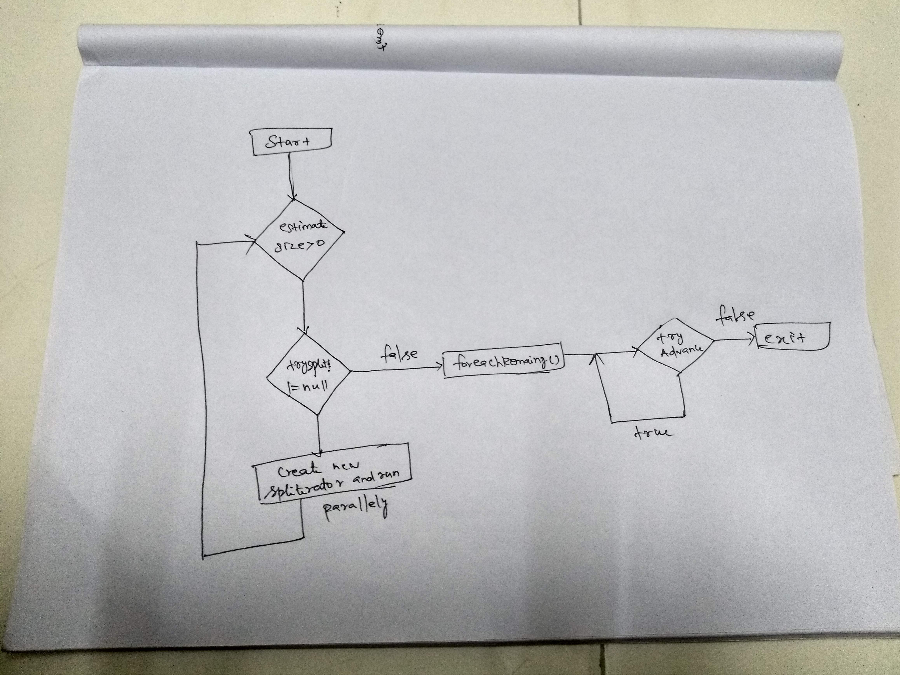

# Spliterator

## Introduction

The spliterator interface abstraction designed to handle the splitting and iteration of stream/collection source.The corresponding method of the interface are 

```java
Spliterator<T> trySplit();
boolean tryAdvance(Consumer<? super T> 
```

### Parallel Stream vs spliterator

Parallelstream\(\) calls `spliterator()` on the collection object which returns a Spliterator implementation that provides the logic of splitting a task. Every source or collection has their own spliterator implementations. Using these spliterators, parallel stream splits the task as long as possible and finally when the task becomes too small it executes it sequentially and merges partial results from all the sub tasks. For example, ArrayList splits the elements based on the indexes. Refer [`ArraySpliterator.java`](http://atetric.com/atetric/javadoc/openjdk/jdk/8u45/java/util/Spliterators.ArraySpliterator.html#trySplit--)

### When to use spliterator

 When we have a stream of objects, but the stream has an internal ordering or structure, meaning that a naive split of the stream at a random point might not produce sections that can validly be processed in parallel

### Workflow



## Methods

### trySplit\(\)

 If current spliterator can be partitioned a new spliterator is created, it partitions the elements of the source so that new spliterator traverse one of the partition while original spliterator traverses the other partition.This method needs to be implemented if we want to create a parallel stream.

### TryAdvance\(\)

 If current spliterator can be partitioned a new spliterator is created, it partitions the elements of the source so that new spliterator traverse one of the partition while original spliterator traverses the other partition.Any custom spliterator must implement tryAdvance. It is this method which is invoked to get each element of a stream to process.

### **forEachRemaining\(\)**

This is the pure optimisation of tryAdvance\(\) if the framework decided to consume the  elements in spliterator ,it can make a single call to `forEachRemaining()` instead of calling `tryAdvance()` for each item individually.

### estimateSize\(\)

The main usage of this method by the stream execution engine is to decide whether to use `trySplit()` or just process the entire spliterator in a single thread;

### getComparator\(\)

This method will return the the comparator instance if the spliterator instance has characteristics of SORTED.

### characteristics\(\)

The spliterator has the following characteristics defined in the spliterator interface.

* `CONCURRENT` - The source data can be modified safely from other threads without lock controls
* `DISTINCT` - No two values are the same
* `IMMUTABLE` - It is not possible to change the source
* `NONNULL` - No values will be null
* `ORDERED` - there is a sequence to the results
* `SIZED` - the size is finite, and also `estimateSize()` is accurate
* `SORTED` - \(requires `ORDERED` as well\) The sequence is pre-defined on some characteristic
* `SUBSIZED` - \(requires `SIZED` as well\) All trySplit\(\) Spliterators will be SIZED & SUBSIZE

## Example

### Scenario

Let's take an example of credit card statement where we need to show the average amount spent by user for each category of spends. We will get of list of payments object from the source and we need to process it  in parallel to calculate the total amount in each category.

### Payment Domain

```java
public class Payment {
	public enum category{
		ALCHOLIC, NONALCHOLIC, LIFESTYLE,ENTERTAINMENT
	}
	private Double amountSpent;
	private category category;
	private Date dateSpent;

	public Payment(Double amountSpent, com.thiyagu.learning.spliterator.Payment.category category) {
		super();
		this.amountSpent = amountSpent;
		this.category = category;
	}
	// getters and setters
}
```

### Spliterator to process payment Objects

First we need to define the PaymentByCategorySpliterator which holds the list of payments object and current and last position of the spliterator.

```java
private List<Payment> paymentList;
	private int current;
	private int last; // inclusive

	public PaymentByCategorySpliterator(List<Payment> payment) {
		this.paymentList = payment;
		last = paymentList.size() - 1;
	}

	public PaymentByCategorySpliterator(List<Payment> payment, int start, int last) {
		this.paymentList = payment;
		this.current = start;
		this.last = last;
	}

```

Till we reach the end of list, we need to call the accept method of the consumer ,update the current position value and return true.

```java
@Override
	public boolean tryAdvance(Consumer<? super Payment> action) {
		if (current <= last) {
			action.accept(paymentList.get(current));
			current++;
			return true;
		}
		return false;
	}
```

The trySplit \(\) method will split the input into no of batches and create new spliterator for each category type in the payments object.

```java
@Override
	public Spliterator<Payment> trySplit() {
		if ((last - current) < 100) {
			return null;
		}

		//start from middle element
		int splitPosition = current + (last - current) / 2;
		// if the categories are the same, we can't split here, as we are in the middle
		// of a batch
		Payment.category categoryBeforeSplit = paymentList.get(splitPosition - 1).getCategory();
		Payment.category categoryAfterSplit = paymentList.get(splitPosition).getCategory();

		// keep moving forward until we reach a split between categories
		while (categoryBeforeSplit.equals(categoryAfterSplit)) {
			splitPosition++;
			categoryBeforeSplit = categoryAfterSplit;
			categoryAfterSplit = paymentList.get(splitPosition).getCategory();
		}

		// safe to create a new spliterator
		PaymentByCategorySpliterator secondHalf = new PaymentByCategorySpliterator(paymentList, splitPosition, last);
		// reset our own last value
		last = splitPosition - 1;

		return secondHalf;
	}
```

The estimate size will be used by iterator to decide either to create more spliterator instance.

```java
@Override
	public long estimateSize() {
		return last - current;
	}
```

### Accumulator to Collect the result

The Average AverageTotalCalculatorByCategory class implements the collector interface. Total and Accumulator are  classes to hold the results of each iteration on the stream.

```java
public class AverageTotalCalculatorByCategory
		implements Collector<Payment, AverageTotalCalculatorByCategory.Accumulator, Map<Payment.category, Double>> {

	public class Total {
		public double amount;
		public int numberOfBatches;
	}

	public class Accumulator {
		Map<Payment.category, Total> totalsByCategory = new HashMap<>();
		Payment.category currentPaymentCategory;
	}

```

This will create new new mutable result container for the stream operation.

```java
	@Override
	public Supplier<Accumulator> supplier() {
		return Accumulator::new;
	}
```

This method will folds the each payment object into the mutable container.

```java
@Override
	public BiConsumer<Accumulator, Payment> accumulator() {
		return (accumulator, payment) -> {
			// store this amount
			Total batchTotalForThisCategory = accumulator.totalsByCategory.get(payment.getCategory());
			if (batchTotalForThisCategory == null) {
				batchTotalForThisCategory = new Total();
				accumulator.totalsByCategory.put(payment.getCategory(), batchTotalForThisCategory);
			}
			batchTotalForThisCategory.amount += payment.getAmountSpent();

			// if this was start of a new batch, increment the counter
			if (!payment.getCategory().equals(accumulator.currentPaymentCategory)) {
				batchTotalForThisCategory.numberOfBatches += 1;
				accumulator.currentPaymentCategory = payment.getCategory();
			}
		};
	}
```

This functions gets the two partially calculated container and merges them into one.This is required only for parallel processing.

```java
@Override
	public BinaryOperator<Accumulator> combiner() {
		return (accumulator1, accumulator2) -> {
			for (Payment.category category : accumulator1.totalsByCategory.keySet()) {
				Total total2 = accumulator2.totalsByCategory.get(category);
				if (total2 == null) {
					accumulator2.totalsByCategory.put(category, accumulator1.totalsByCategory.get(category));
				} else {
					Total total1 = accumulator1.totalsByCategory.get(category);
					total2.amount += total1.amount;
					total2.numberOfBatches += total1.numberOfBatches;
				}
			}
			return accumulator2;
		};
	}
```

This finisher method will perform the final transformation from the intermediate accumulation type

```java
@Override
	public Function<Accumulator, Map<category, Double>> finisher() {
		return (accumulator) -> {
			Map<Payment.category, Double> results = new HashMap<>();
			for (Map.Entry<Payment.category, Total> entry : accumulator.totalsByCategory.entrySet()) {
				Payment.category category = entry.getKey();
				Total total = entry.getValue();
				double averageForBatchInThisCategory = total.amount / total.numberOfBatches;
				//System.out.println("Category::"+category+"NoOfBatch"+total.numberOfBatches);
				results.put(category, averageForBatchInThisCategory);
			}
			return results;
			
		};
	}

```

Complete [source code](https://github.com/thiyagu06/java8Sample/tree/master/src/main/java/com/thiyagu/learning/spliterator) can be found here.

